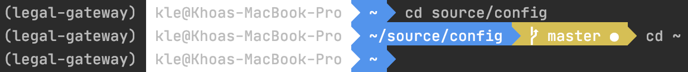
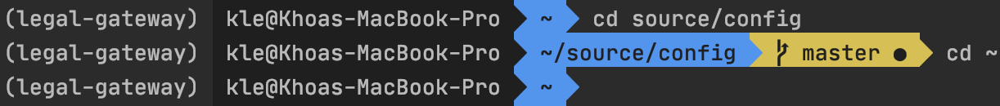

# Improve historical commands search with `hstr`

While most of us are familiar with <kbd>C-r</kbd> for searching previous used commands
in the history. [`hstr`](https://dvorka.github.io/hstr/) provided an enhanced
terminal-based UI where you can easily navigate, view and (obviously) search
the command history.

It is available for both `bash` and `zsh` on various OS.

References:
- https://dvorka.github.io/hstr/

# Fix `powerline` font color when using `zsh` in PyCharm terminal

If the font is broken in your PyCharm terminal, go to `Editor ->Color Scheme -> Console Font`.
Otherwise, if the colors look off, especially when text color appears white
with a light background - or vice versa, dark text color with dark background -
you can go to `Console Colors` following the same path as the previous one.
Here is what it was for me before the fix:

In my case, it is as simple as switching the ANSI color codes for black and
white i.e. switching their hex values.

Feel free to customize further to suit your needs, you always have the option to revert
to default settings.

References:
- https://github.com/Powerlevel9k/powerlevel9k/issues/305
