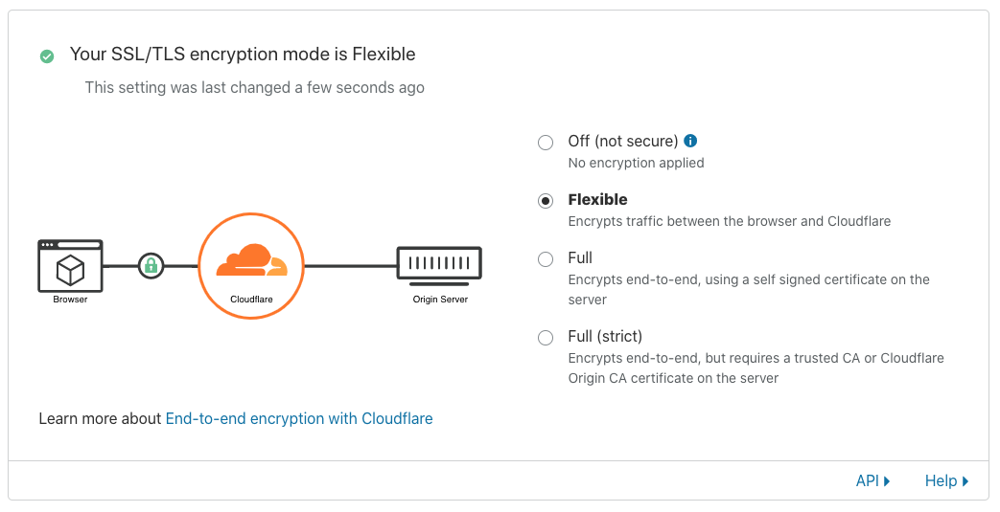

# Setup SSL for Heroku with custom domain on budget

Summary:

- If you're using free plan, you can't have SSL with custom domain. However,
  you can still use the provided `*.herokuapp.com` certificate by default.

- If you're using Cloudlfare as your DNS provider, it's possible to "use" HTTPS
  with your site but it's not 100% secured. The "Flexible" mode allow traffic
  to be encrypted between users/browsers and Cloudflare DNS servers, but traffic
  from Cloudflare to your origin server (in this case Heroku) is totally
  unprotected.

  

- If you upgrade to paid dynos (say Hobby for $7/month), you will get free SSL
  certificates for your site and also be able to use it with your custom domain.

References:
- https://stackoverflow.com/questions/52185560/heroku-set-ssl-certificates-on-free-plan
- https://devcenter.heroku.com/articles/ssl

# Using environment variables in React Native

In the past, [`react-native-dotenv`](https://github.com/zetachang/react-native-dotenv)
used to be a good default choice. However it has been unmaintained for a while
and there is a better alternative now - [`babel-plugin-dotenv-import`](https://github.com/tusbar/babel-plugin-dotenv-import).

Config with `babel.config.js`:

```js
module.exports = function() {
  return {
    plugins: [
      [
        'dotenv-import',
        {
          moduleName: '@env',
          path: '.env',
          blacklist: null,
          whitelist: null,
          safe: false,
          allowUndefined: false
        }
      ]
    ]
  };
};
```

Example usage:

```js
import { API_TOKEN } from '@env';
...
```

References:
- https://github.com/zetachang/react-native-dotenv/issues/67
- https://github.com/tusbar/babel-plugin-dotenv-import
